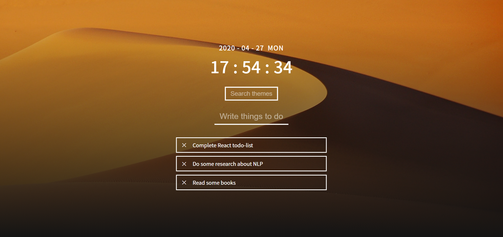

# Simple Todo-List App using React

## How to Access
URL: https://sungpyocho.github.io/react-todolist/

## Features
- Modern, Simple Design
- Set your own background by typing some queries in the 'Search Themes' box!

## For Developers: Available Scripts

In the project directory, you can run:

### `yarn start`

Runs the app in the development mode. 
Open [http://localhost:3000](http://localhost:3000) to view it in the browser.

The page will reload if you make edits. 
You will also see any lint errors in the console.
